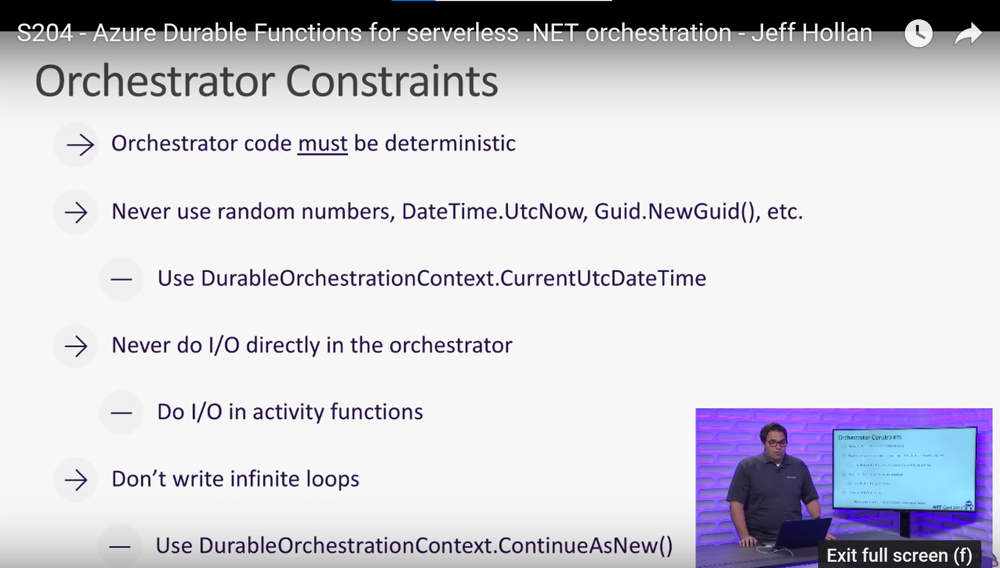

Durable function example.

## Set up notes
Note that this uses Azurite for the local storage emulator

## Constraints for the orhestrator
- Durable function needs to be deterministic
- Some suggestions from https://www.youtube.com/watch?v=UQ4iBl7QMno
    - Don't use random numbers, DateTime.Now, new guids etc.
    - No infinite loops (duh)
    - Never do IO directly on on the orcehestrator

## Workaround to the above constraints

## Considerations around pushing new code for Azure Durable functions
- If you have something running and push new code to the cloud, you can see funnies of mixing old/new code
- Strategies
    - Nothing - funnies are OK/this is an unlikely scenario
    - Wait for orchestrator to drain
    - side by side deployment (update name of task hub on deployment)

## Testing azure functions
- see dotnet test for testing azure functions
- Durable functions more difficult as you'll need to Mock the Durable function context

## Constraining Spec of Serverless node
- in video it's set to 1GB ram and 1 CPU

## Other interesting options
- [Durable entities](https://learn.microsoft.com/en-us/azure/azure-functions/durable/durable-functions-entities?tabs=csharp)
- Also have a look at - circuit breaker pattern

