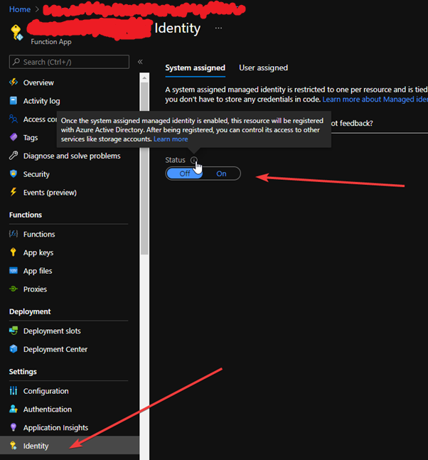
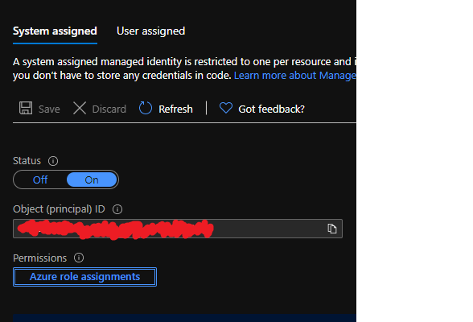
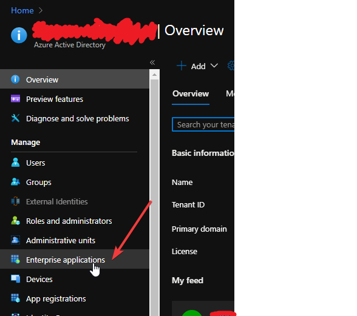
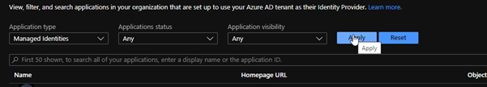
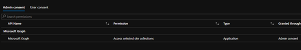

1. Create the function app
2. Create blob storage (Do this when creating the function app)
3. Under function app – enable system assigned managed identity

4. Within the function app identity tab, click on azure role assignments. Add in role assignments to be able to read from a given resource group. This will require administrator privileges.

6. To give the function app the ability to be able to receive the ability to write to sharepoint.
   a.	This will require global azure admin rights
   b.	Run the code contained in AddSitesSelectedToManagedApplicationIdentity.ps1 in azure powershell.
   c.	To check that this has worked as expected.
   d.	Under Azure active directory, navigate to enterprise applications

7. Filter application type = Managed Identities

8. Under permissions this should now display Sites.Selected

9. To give permission for the function app to write to a sharepoint site. Find the function app application id (not object id) by navigating to azure ad > enterprise applications > filter by managed identities> Find function app and select it > Navigate to overview blade.
10. Visit graph explorer and make sure you have personal access to the sharepoint site you’re trying to find.
11. In graph explorer, find the link to the appropriate sharepoint group- the link below may be of more use. You’ll need to use the id
12. https://stackoverflow.com/questions/68955291/accessing-the-shared-documents-folder-within-a-private-group-of-a-sharepoint-sit
13. Once you’ve got the appropriate ID, use the website below to enable the correct permissions. You can also you GraphExplorer.txt as a base.
14. https://devblogs.microsoft.com/microsoft365dev/controlling-app-access-on-specific-sharepoint-site-collections/
15. If you change the POST command to a GET you should see that the api call will return the permissions for you. 

